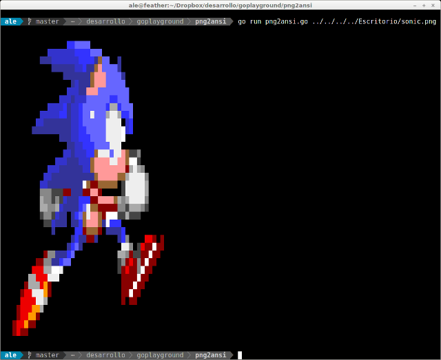

# PNG2ANSI 
### A simple png to ansi text converter written in go
png2ansi is a simple go program to make nice ascii art from images.
Supports 256 colors and alpha channel but your terminal must be capable of this (like gnome-terminal)

Usage: png2ansi <file.png>

example output:

 

 Have fun!